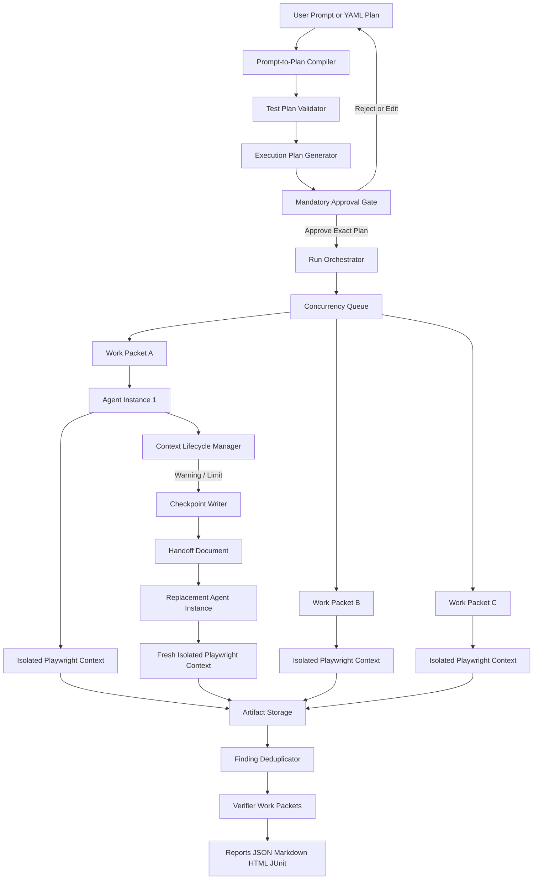

# BrowserSwarm

BrowserSwarm is a local-first, model-agnostic web-application testing framework. You describe what to test
(a natural-language request or a structured YAML plan); BrowserSwarm compiles it into deterministic browser
scenarios, expands them into exact work packets for parallel browser-testing subagents, shows you the complete
execution plan, **waits for your explicit approval**, and only then runs exactly what you approved.

> **Authorization required.** Only test websites and applications you own or are explicitly authorized to test.
> BrowserSwarm blocks destructive and risky actions by default, never solves CAPTCHAs, and never bypasses
> authentication, authorization, rate limits or other security controls. See [docs/safety.md](docs/safety.md).

## Why BrowserSwarm works the way it does

- **User-plan-driven.** Your plan is the scope. Subagents are scoped executors of approved work packets; they do
  not invent coverage, add scenarios, change expected outcomes or relax safety policy.
- **Deterministic by default.** Scripted steps (navigate, click, fill, assert, screenshot, ...) run through typed,
  allowlisted Playwright actions with **zero LLM calls**. LLMs are optional, bounded, policy-controlled fallbacks.
- **Approval-first.** No browser, Playwright context or agent starts before an approval record is bound to the
  exact, hashed execution plan. Any change to the plan or its configuration invalidates the approval.
- **Context-resilient.** An agent instance is disposable. When it nears its context, token, action or time budget,
  BrowserSwarm checkpoints its work, writes a concise structured handoff document, terminates it, and (Milestone 3)
  launches a replacement that continues the _same_ immutable work packet from the handoff.
- **Evidence-based.** Every finding carries evidence (screenshot, URL, bounded redacted DOM, console and network
  records). AI-originated claims are labeled probabilistic unless independently confirmed.

## Architecture



Two execution levels:

| Level              | What it is                                                                                                                                                  | Lifetime                                                             |
| ------------------ | ----------------------------------------------------------------------------------------------------------------------------------------------------------- | -------------------------------------------------------------------- |
| **Work packet**    | Immutable, hash-bound unit of approved work: scenario, role, viewport, exact ordered steps, expected outcome, model, policies, budgets, artifact directory. | Fixed at approval. Never changes.                                    |
| **Agent instance** | Temporary worker executing one work packet. At most one active instance per packet.                                                                         | Disposable; rotated on context, token, action, time or error limits. |

Run lifecycle: `DRAFT -> COMPILED -> VALIDATED -> EXECUTION_PLAN_GENERATED -> PENDING_APPROVAL -> APPROVED -> RUNNING -> COMPLETED | FAILED | CANCELLED`.
Only `APPROVED -> RUNNING` may start browser work. Full details: [docs/architecture.md](docs/architecture.md).

## Repository layout

```
apps/cli                 browserswarm CLI (plan, validate, preview, approve, run, report)
apps/dashboard           run snapshot reader (UI arrives in Milestone 5)
packages/core            Zod schemas, types, state machines, identity hashing
packages/shared          canonical JSON, SHA-256, atomic writes, redaction, ids, clocks
packages/policy-engine   domain allowlist, risk classification, per-action/LLM/handoff/resume checks
packages/plan-compiler   YAML/JSON loading, validation, natural-language compiler
packages/execution-planner  work-packet expansion, estimates, approval review display
packages/approval        hash-bound approval records, risk approval, verification, prompt
packages/orchestrator    run lifecycle, concurrency queue, packet runner
packages/agent-runtime   agent instances and the deterministic scripted agent
packages/context-lifecycle  context accounting and rotation triggers
packages/handoff         checkpoints, handoff writer/validator/renderer, resume context, replacement preflight
packages/browser-tools   typed Playwright actions, locators, domain guard, evidence capture
packages/opencode-adapter  LLMClient interface, MockLLMClient, configurable OpenCodeCliClient
packages/storage         StorageAdapter, filesystem backend, NDJSON event store, artifact layout
packages/reporters       run report (JSON, Markdown)
packages/test-fixtures   local fixture web application (no external network)
examples/                runnable plans, prompts, an execution plan, an approved plan and a handoff example
docs/                    detailed documentation
```

## Installation

Requirements: Node.js 20+, pnpm 10.

```bash
pnpm install
pnpm exec playwright install chromium   # skip if browsers are already provisioned
pnpm build
cp .env.example .env                    # central configuration (see below)
```

## Central configuration (`.env`)

Everything environment-specific lives in one file, `.env` (gitignored; template in `.env.example`):

```bash
BROWSERSWARM_TARGET_URL=https://staging.example.com   # the website under test
BROWSERSWARM_ALLOWED_DOMAINS=                         # optional; defaults to the URL's host
BROWSERSWARM_LLM_API_KEY=sk-...                       # optional; only for LLM-assisted features
BROWSERSWARM_LLM_API_KEY_ENV=ANTHROPIC_API_KEY        # name OpenCode/the provider reads the key from
```

- Every plan without an explicit `target`, every prompt compiled without `--url`, and the fixture server use
  `BROWSERSWARM_TARGET_URL`. Change it once and everything follows. A plan's own `target.url` or the
  `--url` flag still override it when you need to.
- The URL is resolved when a plan is loaded, so it is part of the approved plan hash: after changing it,
  run `preview` and `approve` again. `run --approved-plan` refuses to run a plan approved for a different
  website than the one in `.env`.
- The LLM API key is never written into plans, approval files, artifacts, reports or prompts. It is
  passed only to the OpenCode process (under `BROWSERSWARM_LLM_API_KEY_ENV`) and redacted everywhere.
  Leave it empty to use OpenCode's own login ([docs/opencode.md](docs/opencode.md)).
- Shell or CI variables take precedence over the file; `BROWSERSWARM_ENV_FILE` points to another file.

## Quick start with demo.icatusa.org

The current target is `https://demo.icatusa.org` (the default in `.env.example`). A read-only smoke plan is in
`examples/icatusa-demo/`:

```bash
cp .env.example .env    # BROWSERSWARM_TARGET_URL=https://demo.icatusa.org
pnpm browserswarm validate --plan examples/icatusa-demo/compiled-plan.yaml
pnpm browserswarm preview  --plan examples/icatusa-demo/compiled-plan.yaml --parallel 4 --write plans/execution-plan.json
pnpm browserswarm approve  --plan examples/icatusa-demo/compiled-plan.yaml --execution-plan plans/execution-plan.json
pnpm browserswarm run      --approved-plan plans/approved-execution-plan.json --output artifacts/icatusa-001
```

Requests to hosts outside the allowlist are blocked. If the site loads assets from CDNs, list them in
`BROWSERSWARM_ALLOWED_DOMAINS` (the first run's `inspect_network_failures` evidence shows which ones).

## Quick start with the fixture site

```bash
# First set BROWSERSWARM_TARGET_URL=http://127.0.0.1:4173 in .env
# Terminal 1: the local fixture application at BROWSERSWARM_TARGET_URL
pnpm fixture:serve

# Terminal 2
pnpm browserswarm validate --plan examples/login-validation/compiled-plan.yaml
pnpm browserswarm preview  --plan examples/login-validation/compiled-plan.yaml --parallel 4 --write plans/execution-plan.json
pnpm browserswarm approve  --plan examples/login-validation/compiled-plan.yaml --execution-plan plans/execution-plan.json
pnpm browserswarm run      --approved-plan plans/approved-execution-plan.json --output artifacts/run-001
```

## Quick start from a natural-language prompt

```bash
pnpm browserswarm plan --prompt examples/login-validation/testing-request.md --output plans/compiled-plan.yaml
# review/edit plans/compiled-plan.yaml, then preview, approve and run as above
```

The compiler preserves your scenarios, steps, expected outcomes and restrictions, reports assumptions and
ambiguities, and **never** invents accounts, credentials, routes, coverage, expected outcomes or risky
permissions. Steps it cannot understand are listed and excluded, and the plan is marked `needsReview`.
Prompt grammar: [docs/test-plan-format.md](docs/test-plan-format.md).

Interactive shortcut (plan, validate, generate, display, ask, run):

```bash
pnpm browserswarm run --prompt ./testing-request.md --parallel 4      # target from .env
pnpm browserswarm run --plan ./plans/compiled-plan.yaml --parallel 4
```

## Preview and approval

`preview` prints the complete review: target and allowed domains, scenarios and ordered steps, expected
outcomes, every work packet and its assignment, models per role, viewport matrix, concurrency, test-data
categories, safety policy, action/LLM/token budgets, context and handoff policy, estimated rotations, risky
actions, artifacts and the plan/execution-plan hashes. Then:

```
Approve execution of this exact plan?
Type: approve / reject / export / edit
```

- `approve` writes the approval record and the immutable `approved-execution-plan.json`.
- `reject` persists a rejection; no browser starts.
- `export` writes the plan files and exits.
- `edit` prints instructions; a fresh execution plan and approval are required afterwards.

### CI / noninteractive approval

```bash
pnpm browserswarm approve --plan plan.yaml --execution-plan execution-plan.json --yes
pnpm browserswarm run --plan plan.yaml --yes
```

`--yes` prints the full review, records a `noninteractive` approval bound to the hashes, and **refuses plans
with risky steps** unless `--accept-risk --risk-plan-hash <hash>` names the exact risk plan hash shown in the review.

### Risk approval

Risky steps (account creation, purchases, payments, uploads/downloads, deletion, password changes, invitations,
social posting, email/SMS, data modification) are blocked by default. To run one you must (1) enable the
category in the plan's `safety` policy, (2) approve the execution plan, and (3) give a separate typed risk
approval bound to the risk plan hash. External navigation can never be enabled; add domains explicitly.

## Multi-agent concurrency

Scenarios fan out into the cross-product of scenario x role x viewport (x browser project), e.g. roles
`functional, accessibility` and viewports `desktop, mobile` produce exactly four packets. Up to
`--parallel` packets run at once, each with its own BrowserContext, page, storage state, action ledger,
trace, screenshots, logs, checkpoint chain and handoff chain. Failures in one packet do not stop the others
unless `execution.failFast` is set.

## Context lifecycle, checkpoints and handoffs

The `ContextLifecycleManager` tracks exact provider token usage when reported and conservative estimates
otherwise, plus message count, actions, duration and model errors. Triggers (earliest applicable wins):
warning threshold (default 75%), hard stop (default 85%), per-instance token budgets, message limit,
action limit, duration limit, repeated fallback/model errors, manual rotation. Limits are evaluated only
between actions; a browser action in flight is never interrupted.

On rotation BrowserSwarm persists a hash-verified **checkpoint**, writes a validated **handoff document**
(JSON + Markdown + `.sha256`), and only then terminates the agent instance. A handoff is an operational
record: mission, progress, current browser state, locators, observations, findings, budgets, continuation
instructions and artifact links. It never contains chain-of-thought, raw transcripts, raw DOM, cookies,
credentials or unredacted test data. Handoffs cannot broaden scope: the replacement is verified against the
same work-packet hash, execution-plan hash and safety policy.

Why structured state instead of the model conversation: transcripts grow without bound, leak sensitive
context, mix reasoning with facts and cannot be validated. A compact, schema-validated, hashed record can be
verified, redacted, size-bounded and understood by a fresh agent (or a human).

Details: [docs/context-lifecycle.md](docs/context-lifecycle.md), [docs/handoff-format.md](docs/handoff-format.md).

## OpenCode and LLM fallback

Models are configured per role and invoked through a configurable OpenCode CLI profile (`command`,
`argsTemplate` with `{model}`, output parser, timeout, environment allowlist). The example command syntax is
not guaranteed for every OpenCode version; adapt the template to yours. In `fallback-only` mode a model may
only help re-locate the element of the _approved_ step (strict JSON, Zod-validated, policy-checked); it can
never add steps, change values or expectations, or relax policy. See [docs/opencode.md](docs/opencode.md).

## Reports and artifacts

Each run directory contains metadata (prompt, plan, execution plan, approval record, approved plan, run
state), `events/events.ndjson`, per-packet ledgers, step results, findings, console/network logs,
screenshots, traces, storage state, checkpoints, handoffs and agent-instance records, plus
`reports/report.json` and `reports/report.md`. See [docs/reports.md](docs/reports.md).

## Resuming and replay

A work packet is immutable after approval; an agent instance is disposable. A replacement agent resumes
from `resumeFromStepIndex` using the sanitized storage state when restoration validates, otherwise it
deterministically replays the minimal approved state-building steps and logs the replay. If replay cannot be
done within approved scope, or the handoff cap is reached, the packet is BLOCKED with remaining work reported.
An exhausted context is never silently ignored.

## Milestone status

| Milestone | Scope                                                                                                                                                                                                                        | Status                                                   |
| --------- | ---------------------------------------------------------------------------------------------------------------------------------------------------------------------------------------------------------------------------- | -------------------------------------------------------- |
| 1         | Approval-first deterministic foundation: schemas, hashing, validation, execution plans, approval gate, policy baseline, Playwright executor, fixture site, checkpoints, handoff schemas/writer, JSON/Markdown reports, tests | **Implemented**                                          |
| 2         | Role-specific checks (axe-core, overflow matrix, visual), deduplication, HTML/JUnit reports                                                                                                                                  | Planned                                                  |
| 3         | Automatic replacement agents: storage-state restore, safe replay, resume validation                                                                                                                                          | Planned (interfaces and preflight implemented)           |
| 4         | OpenCode LLM fallback wiring, verifier packets, token telemetry in reports                                                                                                                                                   | Planned (client, mock and structured output implemented) |
| 5         | Dashboard UI, replay tooling, multi-browser projects                                                                                                                                                                         | Planned                                                  |

In Milestone 1, when a lifecycle limit is reached the packet is checkpointed, a validated handoff is persisted,
the agent instance is terminated, and the packet is BLOCKED with `replacement_agent_unavailable`.

## Development

```bash
pnpm lint        # eslint + prettier --check
pnpm typecheck   # tsc over all sources and tests
pnpm test        # vitest: unit + integration (integration uses real Chromium)
pnpm build       # tsc per package, topological order
```

## Troubleshooting

See [docs/troubleshooting.md](docs/troubleshooting.md).

## License

MIT
