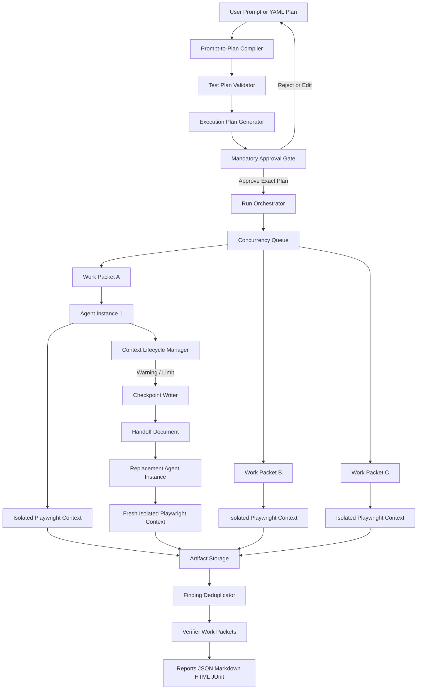

# Architecture



## Components

| Component                   | Package                          | Responsibility                                                                                                                 |
| --------------------------- | -------------------------------- | ------------------------------------------------------------------------------------------------------------------------------ |
| Prompt-to-Plan Compiler     | `plan-compiler`                  | Deterministic grammar compiler (optional LLM compiler) producing an editable `TestPlan`; never invents scope.                  |
| Test Plan Validator         | `plan-compiler`, `policy-engine` | Zod schema (unknown keys rejected), cross references, budgets, template references, plan-time safety policy.                   |
| Execution Plan Generator    | `execution-planner`              | Deterministic cross-product into immutable, hash-bound work packets; estimates; review display.                                |
| Approval Gate               | `approval`                       | Hash-bound approval records, typed risk approval, interactive prompt, verification of approved plans.                          |
| Run Orchestrator            | `orchestrator`                   | Verifies approval before anything else, drives the run state machine, launches the browser, schedules packets.                 |
| Concurrency Queue           | `orchestrator` (`Semaphore`)     | FIFO permits equal to `maxConcurrentWorkPackets`; permits are handed off directly so the limit cannot be exceeded.             |
| Work Packet Lifecycle       | `orchestrator` (`PacketRunner`)  | Packet state machine, isolated BrowserContext, ledger, evidence, findings, checkpoints, handoffs.                              |
| Agent Instance              | `agent-runtime`                  | Disposable executor; the scripted agent runs approved steps in order with zero LLM calls.                                      |
| Context Lifecycle Manager   | `context-lifecycle`              | Exact/estimated context accounting and rotation triggers, evaluated only between actions.                                      |
| Checkpoint Writer / Handoff | `handoff`                        | Hash-protected checkpoints, deterministic handoff writer, validator, Markdown renderer, resume context, replacement preflight. |
| Browser Tools               | `browser-tools`                  | Typed allowlisted Playwright actions, locator resolution, context-level domain guard, observers, failure evidence.             |
| LLM Adapter                 | `opencode-adapter`               | Provider-neutral `LLMClient`, `MockLLMClient`, configurable `OpenCodeCliClient`, strict structured output.                     |
| Artifact Storage / Events   | `storage`                        | `StorageAdapter` interface, filesystem backend with atomic writes, NDJSON event store, artifact layout.                        |
| Reports                     | `reporters`                      | `RunReport` (Zod) and Markdown rendering.                                                                                      |

## Two execution levels

- **Work packet**: immutable after approval. Holds run id, packet id, scenario, role, viewport, exact ordered
  steps (test-data templates unresolved), expected outcome, model, LLM/context/safety policies, timeout,
  action and LLM budgets, artifact directory, plan hash, risk flags and its own `workPacketHash`.
- **Agent instance**: temporary worker bound to one packet. It may be rotated many times; every controlled
  shutdown produces a checkpoint and a handoff. One packet never has two active instances (no cooperative
  same-packet concurrency in v1).

## State machines

All four are defined in `packages/core/src/state-machines.ts`, enforced by `TrackedState`, and every
transition is emitted as an event.

```
Run:        DRAFT -> COMPILED -> VALIDATED -> EXECUTION_PLAN_GENERATED -> PENDING_APPROVAL -> APPROVED -> RUNNING -> COMPLETED | FAILED | CANCELLED
Packet:     PENDING -> QUEUED -> RUNNING -> CHECKPOINTING -> HANDOFF_PENDING -> RESUMING -> RUNNING ... -> COMPLETED | FAILED | BLOCKED | CANCELLED
Agent:      CREATED -> STARTING -> ACTIVE -> CONTEXT_WARNING -> CHECKPOINTING -> TERMINATED -> REPLACED
Handoff:    NOT_REQUIRED -> REQUIRED -> WRITING -> VALIDATED -> PERSISTED -> CONSUMED -> COMPLETED
```

Only `APPROVED -> RUNNING` may initiate browser execution. Rejection moves `PENDING_APPROVAL -> CANCELLED`.

## Identity and hashing

All hashes are SHA-256 over canonical JSON (sorted keys, `undefined` dropped), prefixed `sha256:`. A
document's own hash field is excluded from its input.

| Hash                                 | Input                                                                                              |
| ------------------------------------ | -------------------------------------------------------------------------------------------------- |
| `planHash`                           | Fully defaulted `TestPlan` (so changed defaults also change the hash).                             |
| `workPacketHash`                     | The work packet without its hash.                                                                  |
| `executionPlanHash`                  | The execution plan (including every packet, resolved policies, concurrency, test data references). |
| `riskPlanHash`                       | `{ executionPlanId, riskFlags }`.                                                                  |
| `recordHash`                         | The approval record.                                                                               |
| `approvedPlanHash`                   | `{ executionPlanHash, recordHash }`.                                                               |
| checkpoint / handoff `integrityHash` | The document without `integrityHash`, also stored in a `.sha256` sidecar.                          |

## Enforcement points

- The orchestrator's first action is `verifyApprovedPlan()`; nothing is written, launched or requested before it.
- The policy engine runs at validation, execution-plan generation, before every browser action, before
  every LLM fallback proposal, before every handoff is persisted and before every replacement-agent launch.
- A context-level route guard aborts every request (navigation, fetch, subresource) outside the allowed domains.

## Key principles

- A work packet is immutable after approval; an agent instance is disposable and may be rotated.
- Handoff is operational state, not chain-of-thought.
- Context thresholds should be conservative; rotation should happen before a model fails from context exhaustion.
- Session restoration can fail; the framework may replay safe approved steps and logs that it did.
- Handoffs cannot be used to broaden scope.
- An exhausted context is never silently ignored.
